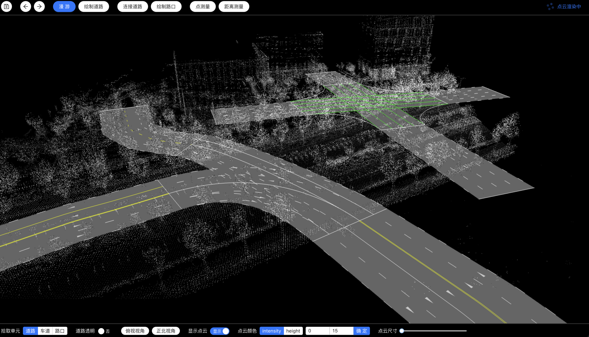

# HDMAP-EDITOR
### 高清地图编辑器实现了基于点云创建、编辑高清地图的场景需求，包含以下操作及功能指引
* [视角切换 + 八叉树点云](./docs/view.md)
* [绘制道路车道](./docs/road_lane.md)
* [绘制路口](./docs/junction.md)
* [点测量 + 距离测量](./docs/measure.md)

### 示例图
* 