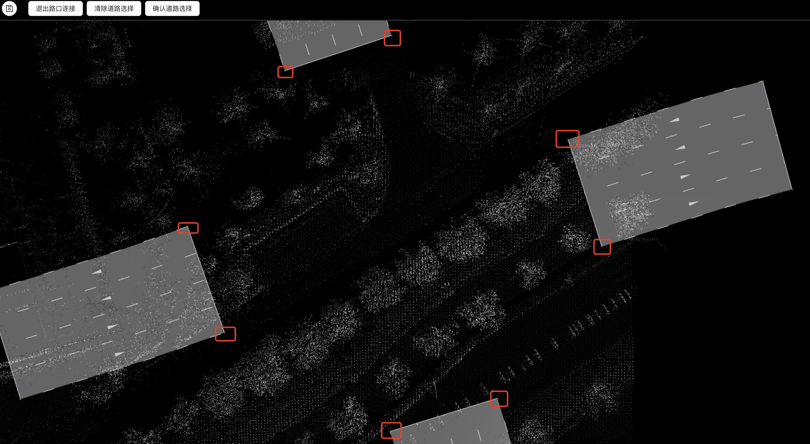
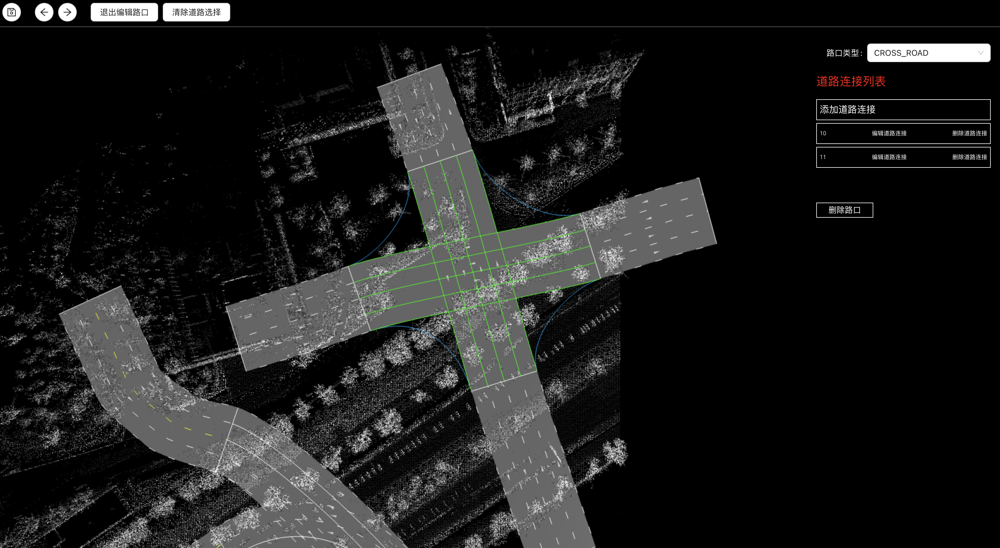

# 绘制路口
### 绘制路口
* 切换到【绘制路口】模式
* 单击拾取路口包含道路的端点，点击确认道路选择生成路口，自动进入此路口编辑模式
  * 

### 编辑路口
* 【拾取单元】切换至【路口】
  * 鼠标悬浮高亮选中路口
  * 鼠标双击进入选中路口编辑模式
* 可在路口参数配置面板上修改路口参数
* 可增删路口内的连接道路
* 
* 点击退出编辑路口或鼠标双击空白处退出路口编辑，进入漫游模式