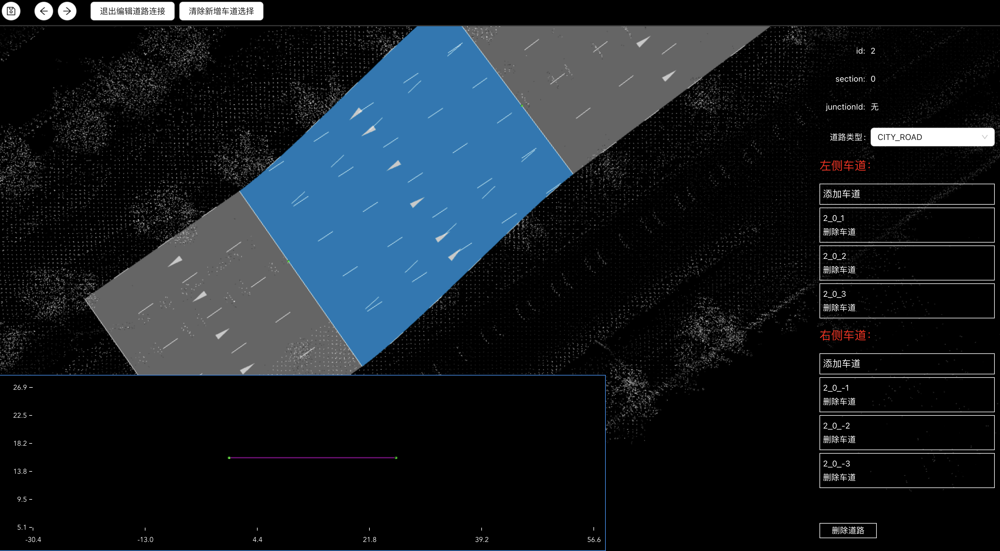

# 绘制道路车道
### 绘制道路
* 切换到【绘制道路】模式
  * 
* 右键单击拾取两个道路端点，生成一条双向单车道直线道路，自动进入此道路编辑模式

### 编辑道路
* 【拾取单元】切换至【道路】
  * 鼠标悬浮高亮选中道路
  * 鼠标双击进入选中道路编辑模式
* 可在道路参数配置面板上修改道路参数
* 可增删道路双侧车道
* 可增删道路控制点控制整条道路走向
* 可根据道路侧视图修改道路整体高程信息
* 沿道路延伸方向继续右键单击拾取点将延长绘制道路
* 
* 点击退出编辑道路或鼠标双击空白处退出道路编辑，进入漫游模式

### 编辑车道
* 【拾取单元】切换至【车道】
  * 鼠标悬浮高亮选中车道
  * 鼠标双击进入选中车道编辑模式
* 可在车道参数配置面板上修改车道参数
* 可增删车道线控制点控制车道线走向
  * 每条车道有两条车道线
  * 除最内侧车道之外，每条车道都可以编辑双侧车道线
* 可根据车道侧视图修改车道外侧车道线高程信息
  * 修改车道外侧车道线高程影响本车道外侧车道线及外侧车道内侧车道线
* 
* 点击退出编辑车道或鼠标双击空白处退出车道编辑，进入漫游模式

### 连接道路
* 切换到【连接道路】模式
* 选中需要连接的道路的各一个端点，系统会根据原有两条道路的绘制方向自动确定道路连接道路的绘制方向并绘制连接道路，并根据原有道路车道情况自动匹配车道连接
* 自动进入此连接道路编辑模式
* 

### 编辑连接道路
* 【拾取单元】切换至【道路】
  * 鼠标悬浮高亮选中道路
  * 鼠标双击进入选中道路编辑模式
* 可在道路参数配置面板上修改道路参数
* 可增删改双侧道路连接车道
* 可根据道路侧视图修改道路整体高程信息
* 
* 点击退出编辑道路或鼠标双击空白处退出道路编辑，进入漫游模式